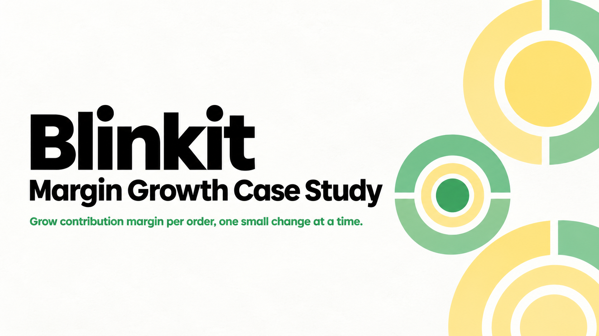

# Blinkit: Margin Growth Case Study

A product case study on one question: how can Blinkit make more money on every 10 minute delivery?

**Problem:** Quick commerce needs dark stores, dedicated riders and small baskets, and all three squeeze margins at the same time. As an APM, I had to suggest product changes that raise revenue or cut costs per order.

## What I did

1. **Broke down the unit economics** of an average Rs 600 order: COGS Rs 420, delivery Rs 45, dark store Rs 30, packaging Rs 25, leaving about Rs 80 (13%) as contribution margin.
2. **Benchmarked** Blinkit against Zepto and Swiggy Instamart on daily orders, delivery fee, market share and margin profile.
3. **Picked a North Star Metric:** Contribution Margin Per Order (CMPO), with a target of Rs 80 to Rs 110 in 12 months.
4. **Proposed 7 ideas:** Optional Carry Bag, Optional Quick Delivery, You Might Also Like, Buy Now, Combo Store, Blinkit Originals and Restructured Categories.
5. **Prioritised them with RICE.** Optional Carry Bag and Buy Now came out on top.
6. **Defined metrics, risks and guardrails,** plus a phased rollout (test on 5% of users in 2 cities, go or no-go in week 5, then scale).

## Read the full deck

[Blinkit Case Study (PDF)](https://drive.google.com/file/d/1GdXJLamUKZZcfKR0woDBJx_Yrd86uzBF/view?usp=sharing)

## Note

The numbers are illustrative estimates based on public reports. Actual figures vary by city and order mix.

## Author

Kharanshu Papolli, IIT (ISM) Dhanbad
[LinkedIn](https://www.linkedin.com/in/kharanshuyp)
